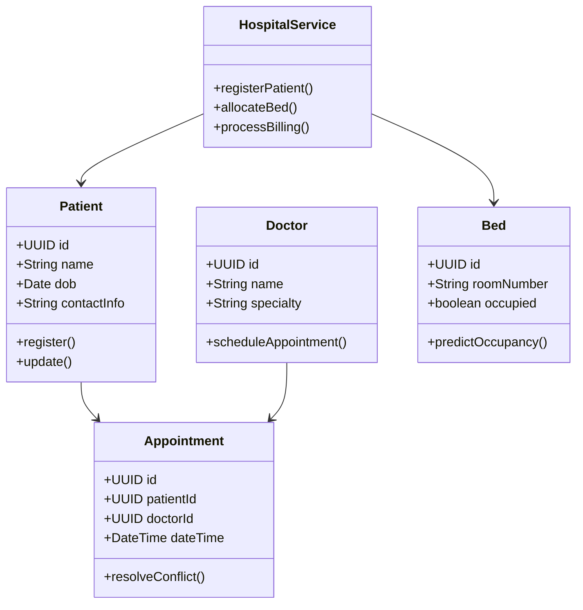
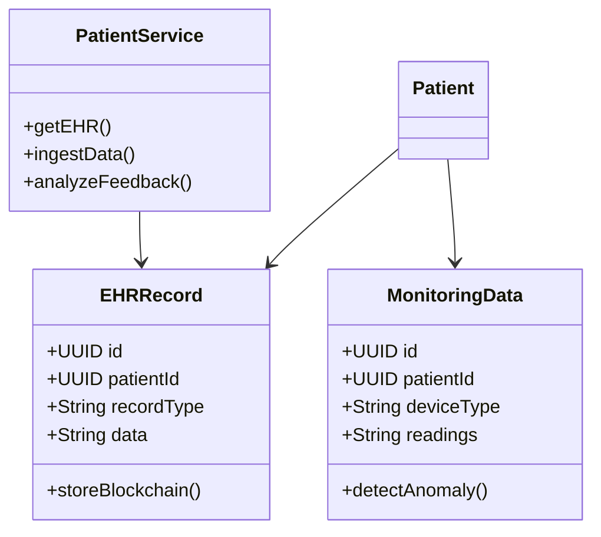
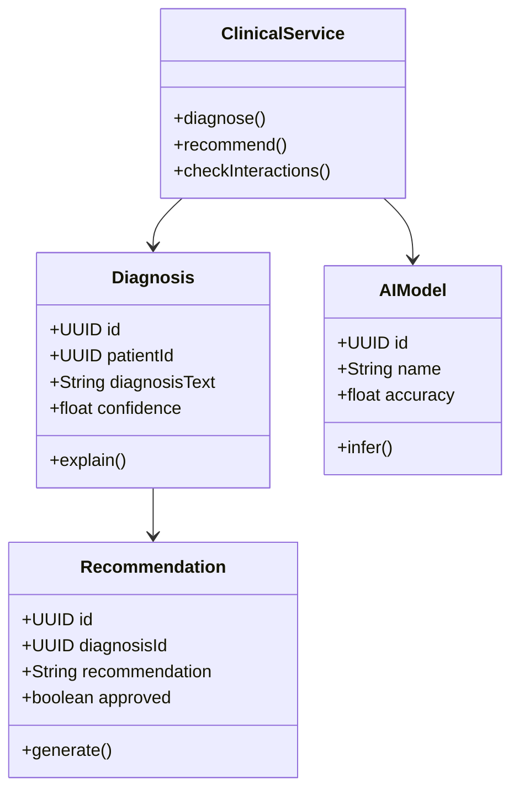
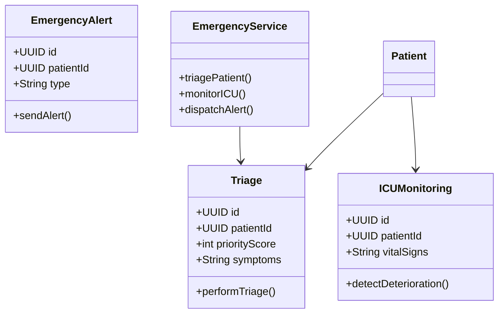
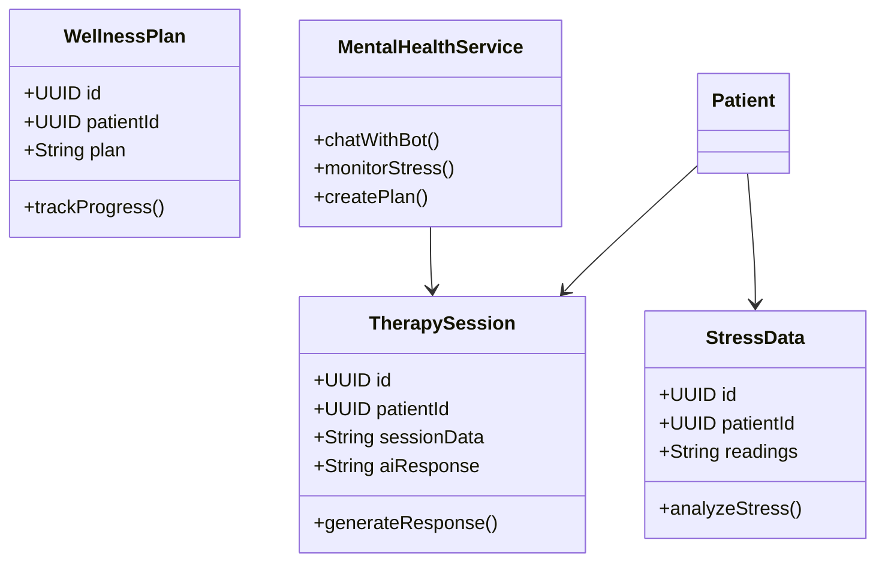

# Class/Module Structures with UML Diagrams

This document provides UML class diagrams for the core modules using Spring Boot entities, services, and controllers.

## Hospital Management Module


## Patient-Centric Module


## Clinical Decision Support Module


## Emergency & Critical Care Module


## Mental Health & Wellness Module


## Pharmacy & Medication Module
```mermaid
classDiagram
    class Prescription {
        +UUID id
        +UUID patientId
        +String medication
        +String dosage
        +checkInteractions()
    }
    class Inventory {
        +UUID id
        +String medication
        +int stockLevel
        +reorderIfNeeded()
    }
    class AdherenceTracking {
        +UUID id
        +UUID prescriptionId
        +boolean taken
        +sendReminder()
    }
    class PharmacyService {
        +issuePrescription()
        +manageInventory()
        +trackAdherence()
    }
    Patient --> Prescription
    Prescription --> AdherenceTracking
    PharmacyService --> Inventory
    ```
    
    ## Public Health & Epidemiology Module
    ```mermaid
    classDiagram
        class OutbreakData {
            +UUID id
            +String disease
            +String location
            +int cases
            +predictOutbreak()
        }
        class VaccinationRecord {
            +UUID id
            +UUID patientId
            +String vaccine
            +int doseNumber
            +trackImmunity()
        }
        class EpidemicModel {
            +UUID id
            +String modelName
            +runSimulation()
        }
        class PublicHealthService {
            +monitorOutbreaks()
            +manageVaccinations()
            +simulateEpidemics()
        }
        Patient --> VaccinationRecord
        PublicHealthService --> OutbreakData
    ```
    
    ## Diagnostics & Lab Systems Module
    ```mermaid
    classDiagram
        class LabTest {
            +UUID id
            +UUID patientId
            +String testType
            +String results
            +orderTest()
        }
        class ImagingData {
            +UUID id
            +UUID labTestId
            +String imageUrl
            +analyzeImage()
        }
        class AIAnalysis {
            +UUID id
            +UUID imagingId
            +String findings
            +float confidence
            +reviewFindings()
        }
        class DiagnosticsService {
            +processLabTest()
            +analyzeImaging()
            +generateReport()
        }
        Patient --> LabTest
        LabTest --> ImagingData
        DiagnosticsService --> AIAnalysis
    ```
    
    ## Insurance & Billing Module
    ```mermaid
    classDiagram
        class InsuranceClaim {
            +UUID id
            +UUID patientId
            +float claimAmount
            +String status
            +submitClaim()
        }
        class FraudDetection {
            +UUID id
            +UUID claimId
            +String flags
            +detectFraud()
        }
        class Reimbursement {
            +UUID id
            +UUID claimId
            +float amount
            +processPayment()
        }
        class InsuranceService {
            +validateClaim()
            +checkFraud()
            +issueReimbursement()
        }
        Patient --> InsuranceClaim
        InsuranceClaim --> FraudDetection
        InsuranceService --> Reimbursement
    ```
    
    ## Sequence Diagram for Patient Registration
```mermaid
sequenceDiagram
    participant UI
    participant HospitalService
    participant PatientRepo
    participant DB
    UI->>HospitalService: registerPatient(request)
    HospitalService->>PatientRepo: save(patient)
    PatientRepo->>DB: INSERT
    DB-->>PatientRepo: success
    PatientRepo-->>HospitalService: patient
    HospitalService-->>UI: response
```

These structures use Hibernate for ORM, with repositories and services following Spring patterns.