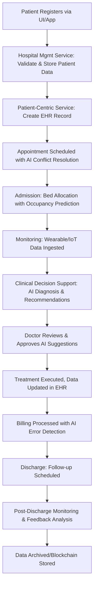
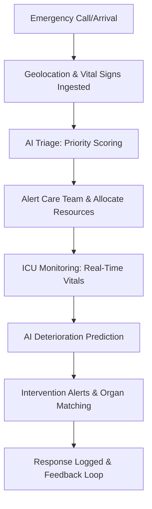
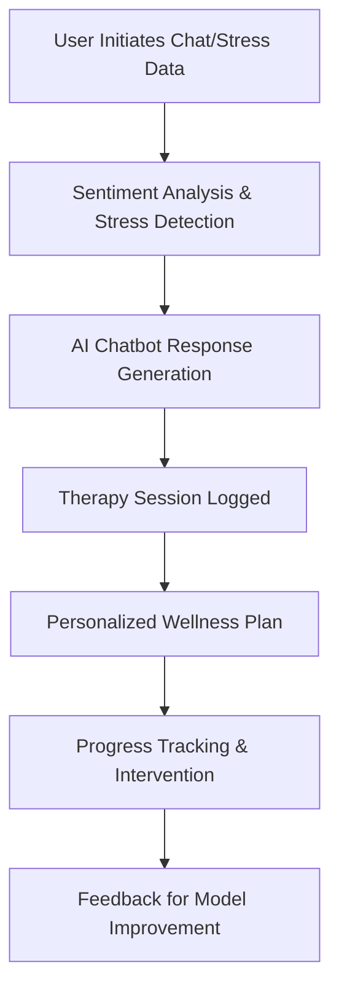
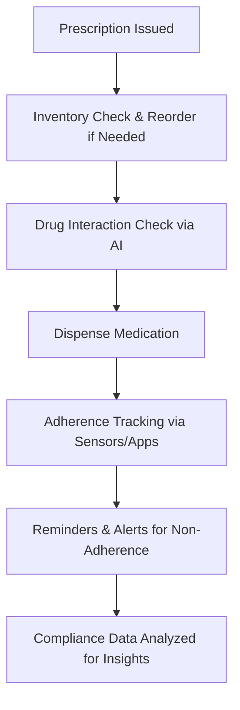
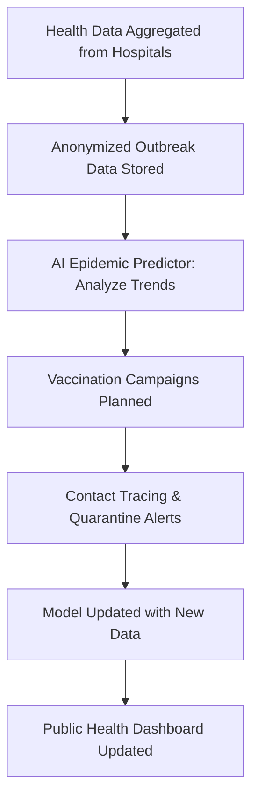
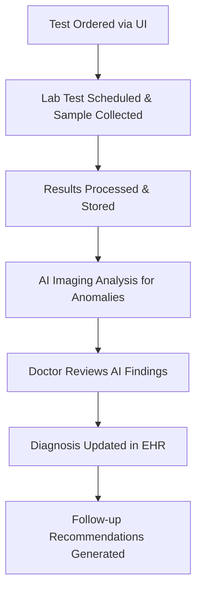
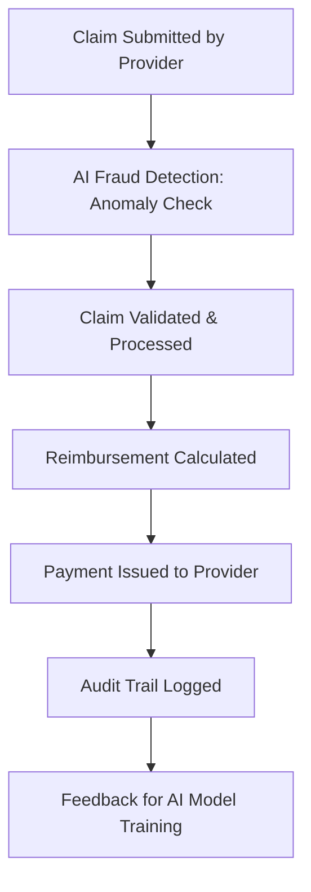

# Data Flow Diagrams

## Patient Journey Data Flow
This diagram shows the flow of patient data from registration to discharge, integrating hospital management, patient-centric systems, and clinical decision support.



## AI Decision Processes Data Flow
This diagram illustrates how AI processes clinical data for decision support, ensuring explainability and human oversight.

```mermaid
flowchart TD
    A[Clinical Data Input: Symptoms, Labs, Imaging] --> B[Data Preprocessing: Normalization, Encryption]
    B --> C[AI/ML Engine: Model Selection (e.g., Diagnosis Predictor)]
    C --> D[Inference via Local LLM/Ollama]
    D --> E[Generate Recommendations with Confidence Scores]
    E --> F[Bias & Fairness Check]
    F --> G[Explainable Output: Counterfactual Reasoning]
    G --> H[Human Doctor Review & Approval]
    H --> I[Integrate into EHR & Notify Care Team]
    I --> J[Feedback Loop: Update Model via Federated Learning]
    J --> K[Audit Log for Compliance]
```

## Emergency Response Data Flow
This diagram shows the flow for emergency triage and critical care.



## Mental Health Interaction Data Flow
This diagram illustrates AI chatbot and wellness monitoring.



## Pharmacy Dispensing Data Flow
This diagram shows medication management and adherence.



## Public Health Surveillance Data Flow
This diagram shows outbreak monitoring and epidemic prediction.



## Diagnostics Workflow Data Flow
This diagram illustrates lab testing and AI imaging analysis.



## Insurance Claims Processing Data Flow
This diagram shows claim submission and fraud detection.



## Key Data Flows
- **Real-Time Streams**: Monitoring data via Kafka for anomaly detection.
- **Batch Processing**: Historical data for predictive analytics.
- **Security**: All flows encrypted; access via ABAC.
- **Interoperability**: FHIR/HL7 for external data exchange.