# Database Schema for Core Modules

This schema uses PostgreSQL for the core modules: Hospital Management & Administration, Patient-Centric Systems, and Clinical Decision Support. It includes encryption for sensitive data, audit trails, and sharding considerations.

## Key Tables

### Hospital Management & Administration
- **patients**: Basic patient info.
- **doctors**: Staff details.
- **appointments**: Scheduling.
- **beds**: Allocation.
- **resources**: Equipment/staff tracking.
- **billing**: Claims and payments.

### Patient-Centric Systems
- **ehr_records**: Health records (blockchain-linked).
- **monitoring_data**: Wearable/sensor data.
- **feedback**: Patient satisfaction.

### Clinical Decision Support
- **diagnoses**: AI-supported diagnoses.
- **recommendations**: Treatment suggestions.
- **ai_models**: Model metadata.

### Emergency & Critical Care
- **triage**: Patient priority scoring.
- **icu_monitoring**: Vital signs tracking.
- **emergency_alerts**: Notifications and responses.

### Mental Health & Wellness
- **therapy_sessions**: Chatbot interactions.
- **stress_data**: Wearable stress readings.
- **wellness_plans**: Personalized recommendations.

### Pharmacy & Medication
- **prescriptions**: Issued medications.
- **inventory**: Drug stock levels.
- **adherence_tracking**: Patient compliance data.

## ER Diagram

```mermaid
erDiagram
    PATIENTS ||--o{ APPOINTMENTS : schedules
    PATIENTS ||--o{ EHR_RECORDS : has
    PATIENTS ||--o{ MONITORING_DATA : generates
    PATIENTS ||--o{ DIAGNOSES : receives
    PATIENTS ||--o{ RECOMMENDATIONS : gets
    PATIENTS ||--o{ BEDS : occupies
    PATIENTS ||--o{ BILLING : incurs
    PATIENTS ||--o{ TRIAGE : undergoes
    PATIENTS ||--o{ ICU_MONITORING : receives
    PATIENTS ||--o{ THERAPY_SESSIONS : participates
    PATIENTS ||--o{ STRESS_DATA : provides
    PATIENTS ||--o{ PRESCRIPTIONS : receives
    DOCTORS ||--o{ APPOINTMENTS : conducts
    DOCTORS ||--o{ DIAGNOSES : provides
    DOCTORS ||--o{ RECOMMENDATIONS : suggests
    RESOURCES ||--o{ BEDS : includes
    RESOURCES ||--o{ APPOINTMENTS : uses
    AI_MODELS ||--o{ DIAGNOSES : supports
    AI_MODELS ||--o{ RECOMMENDATIONS : powers
    AI_MODELS ||--o{ TRIAGE : assists
    AI_MODELS ||--o{ THERAPY_SESSIONS : powers
    INVENTORY ||--o{ PRESCRIPTIONS : supplies
```


## SQL Schema
```sql
-- Patients Table
CREATE TABLE patients (
    id UUID PRIMARY KEY DEFAULT gen_random_uuid(),
    name VARCHAR(255) NOT NULL,
    dob DATE,
    contact_info JSONB, -- Encrypted
    national_id VARCHAR(255) UNIQUE, -- Encrypted
    created_at TIMESTAMP DEFAULT NOW(),
    updated_at TIMESTAMP DEFAULT NOW()
);

-- Doctors Table
CREATE TABLE doctors (
    id UUID PRIMARY KEY DEFAULT gen_random_uuid(),
    name VARCHAR(255) NOT NULL,
    specialty VARCHAR(255),
    schedule JSONB,
    created_at TIMESTAMP DEFAULT NOW()
);

-- Appointments Table
CREATE TABLE appointments (
    id UUID PRIMARY KEY DEFAULT gen_random_uuid(),
    patient_id UUID REFERENCES patients(id),
    doctor_id UUID REFERENCES doctors(id),
    date_time TIMESTAMP,
    status VARCHAR(50),
    ai_conflict_resolved BOOLEAN DEFAULT FALSE
);

-- Beds Table
CREATE TABLE beds (
    id UUID PRIMARY KEY DEFAULT gen_random_uuid(),
    room_number VARCHAR(50),
    occupied BOOLEAN DEFAULT FALSE,
    patient_id UUID REFERENCES patients(id),
    occupancy_prediction JSONB
);

-- Resources Table
CREATE TABLE resources (
    id UUID PRIMARY KEY DEFAULT gen_random_uuid(),
    type VARCHAR(100), -- e.g., equipment, staff
    availability JSONB,
    predictive_maintenance JSONB
);

-- EHR Records Table (Blockchain-linked)
CREATE TABLE ehr_records (
    id UUID PRIMARY KEY DEFAULT gen_random_uuid(),
    patient_id UUID REFERENCES patients(id),
    record_type VARCHAR(100),
    data JSONB, -- Encrypted, immutable via blockchain
    blockchain_hash VARCHAR(255),
    created_at TIMESTAMP DEFAULT NOW()
);

-- Monitoring Data Table
CREATE TABLE monitoring_data (
    id UUID PRIMARY KEY DEFAULT gen_random_uuid(),
    patient_id UUID REFERENCES patients(id),
    device_type VARCHAR(100),
    readings JSONB,
    timestamp TIMESTAMP DEFAULT NOW(),
    anomaly_alert BOOLEAN DEFAULT FALSE
);

-- Diagnoses Table
CREATE TABLE diagnoses (
    id UUID PRIMARY KEY DEFAULT gen_random_uuid(),
    patient_id UUID REFERENCES patients(id),
    doctor_id UUID REFERENCES doctors(id),
    ai_supported BOOLEAN DEFAULT TRUE,
    diagnosis_text TEXT,
    confidence_score DECIMAL(3,2),
    created_at TIMESTAMP DEFAULT NOW()
);

-- Recommendations Table
CREATE TABLE recommendations (
    id UUID PRIMARY KEY DEFAULT gen_random_uuid(),
    patient_id UUID REFERENCES patients(id),
    diagnosis_id UUID REFERENCES diagnoses(id),
    recommendation TEXT,
    ai_generated BOOLEAN DEFAULT TRUE,
    approved_by_doctor BOOLEAN DEFAULT FALSE
);

-- AI Models Table
CREATE TABLE ai_models (
    id UUID PRIMARY KEY DEFAULT gen_random_uuid(),
    name VARCHAR(255),
    version VARCHAR(50),
    accuracy DECIMAL(3,2),
    last_trained TIMESTAMP,
    federated BOOLEAN DEFAULT TRUE
);

-- Billing Table
CREATE TABLE billing (
    id UUID PRIMARY KEY DEFAULT gen_random_uuid(),
    patient_id UUID REFERENCES patients(id),
    amount DECIMAL(10,2),
    status VARCHAR(50),
    ai_error_detected BOOLEAN DEFAULT FALSE,
    created_at TIMESTAMP DEFAULT NOW()
);

-- Feedback Table
CREATE TABLE feedback (
    id UUID PRIMARY KEY DEFAULT gen_random_uuid(),
    patient_id UUID REFERENCES patients(id),
    rating INT,
    comments TEXT,
    sentiment_score DECIMAL(3,2), -- AI-analyzed
    created_at TIMESTAMP DEFAULT NOW()
);

-- Triage Table
CREATE TABLE triage (
    id UUID PRIMARY KEY DEFAULT gen_random_uuid(),
    patient_id UUID REFERENCES patients(id),
    priority_score INT,
    symptoms TEXT,
    ai_predicted BOOLEAN DEFAULT TRUE,
    created_at TIMESTAMP DEFAULT NOW()
);

-- ICU Monitoring Table
CREATE TABLE icu_monitoring (
    id UUID PRIMARY KEY DEFAULT gen_random_uuid(),
    patient_id UUID REFERENCES patients(id),
    vital_signs JSONB,
    alerts JSONB,
    timestamp TIMESTAMP DEFAULT NOW()
);

-- Emergency Alerts Table
CREATE TABLE emergency_alerts (
    id UUID PRIMARY KEY DEFAULT gen_random_uuid(),
    patient_id UUID REFERENCES patients(id),
    alert_type VARCHAR(100),
    response_status VARCHAR(50),
    geolocation JSONB,
    created_at TIMESTAMP DEFAULT NOW()
);

-- Therapy Sessions Table
CREATE TABLE therapy_sessions (
    id UUID PRIMARY KEY DEFAULT gen_random_uuid(),
    patient_id UUID REFERENCES patients(id),
    session_data TEXT,
    sentiment_analysis DECIMAL(3,2),
    ai_response TEXT,
    created_at TIMESTAMP DEFAULT NOW()
);

-- Stress Data Table
CREATE TABLE stress_data (
    id UUID PRIMARY KEY DEFAULT gen_random_uuid(),
    patient_id UUID REFERENCES patients(id),
    readings JSONB,
    intervention_suggested BOOLEAN DEFAULT FALSE,
    timestamp TIMESTAMP DEFAULT NOW()
);

-- Wellness Plans Table
CREATE TABLE wellness_plans (
    id UUID PRIMARY KEY DEFAULT gen_random_uuid(),
    patient_id UUID REFERENCES patients(id),
    plan_details TEXT,
    ai_generated BOOLEAN DEFAULT TRUE,
    progress DECIMAL(3,2)
);

-- Prescriptions Table
CREATE TABLE prescriptions (
    id UUID PRIMARY KEY DEFAULT gen_random_uuid(),
    patient_id UUID REFERENCES patients(id),
    medication VARCHAR(255),
    dosage VARCHAR(100),
    adherence_rate DECIMAL(3,2),
    created_at TIMESTAMP DEFAULT NOW()
);

-- Inventory Table
CREATE TABLE inventory (
    id UUID PRIMARY KEY DEFAULT gen_random_uuid(),
    medication VARCHAR(255),
    stock_level INT,
    expiry_date DATE,
    reorder_alert BOOLEAN DEFAULT FALSE
);

-- Adherence Tracking Table
CREATE TABLE adherence_tracking (
    id UUID PRIMARY KEY DEFAULT gen_random_uuid(),
    prescription_id UUID REFERENCES prescriptions(id),
    taken BOOLEAN,
    timestamp TIMESTAMP DEFAULT NOW()
);
```

## Security Notes
- Sensitive fields (e.g., contact_info, national_id, ehr_data) are encrypted using PostgreSQL's pgcrypto.
- Audit triggers for all tables to log changes.
- Sharding by patient_id for scalability.